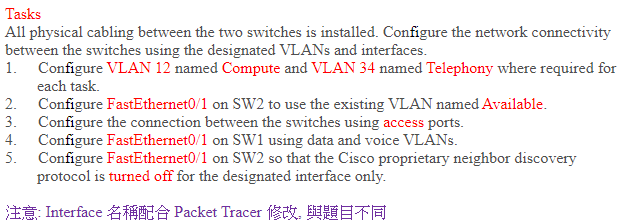
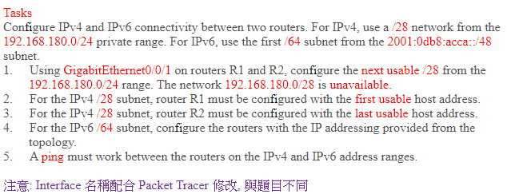
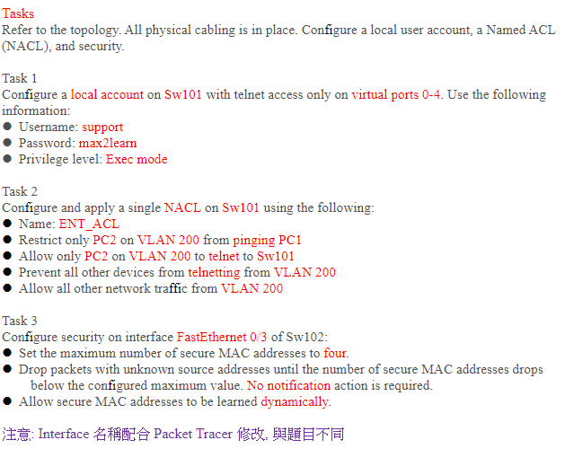

# 統整筆記  ‵
1. neighbor discovery via the `vendor-neutral protocol`要想到lldp  

## 808:  

99是native,所以主要以56,77有allowed為主  
+ 在按"Next"之前要先把所有switch的configuration存到NVRAM之內  

### 1.sw1,2 allow的有56,77   

`en`  
`show running-config`  
`show vlan`  -------------------------------不用特別設定了,已設  
`conf t`  
`interface range fa0/1-2`  --------------------一次設兩個  
`switchport mode trunk` -----------------不確定題目是否已設,但養好習慣   
`switchport trunk allowed vlan 56,77`  

### 2.sw3,4 一樣同1  
變化:
`interface range fa-2`

### 3..
`int fa0/1`  
`switchport trunk native vlan 99`

### 4.要用工業標準的protocol而不是cisco的,可知要用LACP而非PAGP--->active  

`int range fa0/3-4`  
`channel-group 34 mode active`  -----------圖上有寫Po34  

### 5.這個new link就是port channel 34,在上面允許vlan56,77  

`int port-channel34`  
`switchport mode trunk`-------好習慣  
`switchport trunk allowed vlan 56,77`  

### 最後  
記得將configuration儲存到NVRAM   

`end` ----------結束設定  
`copy running-config startup-config` 或是 `write`  
可簡成`copy run start`或是`wri`  
>write是早期在 running-config還沒出來前使用的 ,功能一樣  

  
完整為88%  

## 1041  

設完channel-group 44就會生成一個port-channel 44  
要設trunk等,針對etherchannel的設定都設在這個port-channel會比較好  

### 2:  
先用他會出現錯誤*trunk encapsulation is "Auto" can not be configured to "trunk" mode.*  
所以要先改encapsulation    
所以先做#3  
再來這`switch mode trunk`
### 3:  
`switchport trunk encapsulation dot1q`  告訴他封裝格式是802.1q  

### 4:  
可知是native,  
先`show vlan`知道monitoring是編號多少的vlan    
在conf t介面下可以直接`do show vlan`就不用跳回去了  
`switchport trunk native vlan #編號`  

## 1043  

### 1:
是host route到r1 lookback address 
r2若沒跑動態路由,不知道怎麼送到192.168.1.1   
r1也不知道230的地址所以他也要  ip route
`ip route 192.168.1.1 255.255.255.255 209.165.200.229`  
R2需要`iproute 192.168.1.1 255.255.255.255 209.168.20.225`  

### 2:  
default 是0.0.0.0 0.0.0.0  
`ip route 0.0.0.0 0.0.0.0 209.165.202.130`    
`ipv6 route ::/0 2001:db8:abcd::2`  
 

## *1052  

所有送往R1的的都需要經過r2
r3的三個來源ip都要轉換,用standard access list叫PUBNET
### 1: 
r3需要設定`ip route 192.168.1.1 255.255.255.255 10.2.3.2`   
`sh running-config`發現已經有了
r2:  
`ip access-list standard PUBNET`    
`permit host 10.1.3.11`   
`permit host 10.2.3.3`   
`permit host 192.168.3.1`   
`ip nat inside source list PUBNET interface g0/0/0 overlord`  
`interface g0/0/1`   
`ip nat inside` 
`interface g0/0/0`  
`ip nat outside`   

`show ip nat translations`  ----看有沒有對應資料,沒出來就是沒有,從r3 ping完就會出來  

### 2:  
r1:  
`ntp master`  設定成NTP server  
r2:  
`ntp server 10.1.3.1`  設定成client,**注意ip是g0/0/2這個介面當server**  
  
在r1#  
`clock set 0:0:0 may 1 2018` 設定時間  

### 3: 
r1:
`ip dhcp pool NETPOOL`    
`network 10.1.3.0 255.255.255.0`  
`ip dhcp excluded-address 10.1.3.1 10.1.3.10`  

r3:  
`int g0/0/2`   
`ip address dhcp`    

### 4: 
只能用SSH從r1到r3  
設定使用者和密碼沒說要不要加密,就用passworda命令就好  
設定RSA的金鑰1024bit  
要做RSA:
1. hostname不能是預設,在這已經設定了     
2. ip domain name    
3. crypto key generate rsa gereral-keys modulus 1024  

r3:  
`ip domain-name cisco.com`    
`crypto key generate rsa general-keys modulus 1024`
`username netadmin password N3t4ccess`
`line vty 0 4`    
`login local`   
`transport input ssh` 

在r1測試:  
`telnet 10.1.3.11`
`ssh -l netadmin 10.1.3.11`

## 1054  

### 1:  
取名sw1,2都要
`vlan 12`  
`name Compute`  
還有vlan34  
### 2: 
name完
`int fa0/1`     
`switchport mode access`  
`switchport access vlan 99`    

### 3:  
sw1,2都要
`interface fa0/2`  
`switchport mode access`  
`switchport access vlan 12`  

### 4:  
`interface fa0/1`    
`switchport mode access`      
`switchport access vlan 12`  設定data vlan
`switchport voice vlan 34`  設定voice valn

### 5:  
就是要把cdp關掉  
`int fa0/1`   
`no cdp enable`     

## 1058:  

### 1:
要用出下一個可用ip 範圍,第一個192.168.180.0-15是第一個範圍,題目說不可用  
所以提示是要我們用192.168.180.16-31  
+ 要注意ipv4預設會做routing ,但是ipv6預設不會做routing    
所以要下`ipv6 unicast-routing`    
記得`no shutdown`  
### 2:
第一個不是192.168.180.16而是17  
`ip address 192.168.180.17 255.255.255.240`    
`ipv6 address 直接打上去`  
### 3:
最後一個可用不是192.168.180.31而是30  

**ping ipv6時不要加/64 **  

## 1059  

swiwtch trunk encapsulation dot1q  
+ 注意到pc的access還是要設定vlan   
+ 注意sw內原本存在的vlan也需要讓他通過(100,200,300),實際考試可能不存在,請再注意   
+ 有需要要設定native vlan(老師的沒有檢查) `switchport trunk native vlan 300`  

## *1060  

`sh run`可以發現fa0/1有下`no switchport` 是把二層功能關掉變成三層  

### 1:
user-exec 的等級是1   
privilege-exec 的是15  
老師判斷可能是要我們一進去就直接是sw101# 這種,所以要在username和password中間加入privilege   
`username support privilege 15 password max2learn`  
`line vty 0 4`    
`transport input telnet` 指接受telnet不接受ssh     
`login local`     沒有login local會直接就登陸沒認證,login則是只有密碼認證  

30%
### 2:  
`ip access-list extended ENT_ACL` 因為有包含telnet等等資訊,所以是延伸ACL要加extended  

*要禁止什麼就是deny*  
`deny icmp host 192.168.200.10 host 192.168.100.10 echo`  
>ping 命令就是基於 ICMP 協議來工作的,後面加echo是指把icm的echo封包禁掉  
ping過去是送一個echo 封包,回傳是一個echo reply ,老師認為加echo會比較好       

+ ENT_ACL一定是在layer3介面,因為他有用到ip位置,tcp必須是layer3   

只有pc2可以telnet sw101  
`permit tcp host 192.168.200.10 any eq 23` 或是eq tenet一樣,後面any是到哪邊     
`deny tcp any any eq 23`  
`permit ip any any`  允許其他流量通過  
`interface valn 200`    
`ip access-group ENT_ACL in`

50%

### 3:  
prot security有三種violation 
1. shutdown(預設) -----超過會發通知  
2. protect  
3. restrict  --------------超過會發通知  
可知要用protect,不然其他超過4個那個介面變err-disable原本的也不能通    

`int fa0/3`  
`switch port-security`  啟用,自帶動態學習
`switch port-security maximum 4`  
`switch port-security violation protect`  

#3的3.switch port-security自帶動態學習  
特別寫這個是為了指出動態學習且要加sticky把他變設定指令,出現在running-config內  
`switch port-security mac-address sticky`  

## **1061  

### 1:
只要前面有algorithm type後面就不能是password,必須是secret  
 **需要使用`username wheel privilege 15 algorithm-type scrypt secret lock3path` 命令，  
 但 Packet Tracer 目前並不支援 algorithm-type!!**  

 所以改以下替代:  
`username wheel privilege 15 secret lock3path`  
`line vty 0 4`    
`transport input telnet` 指接受telnet不接受ssh     
`login local`

25%
### 2:
`ip access-list extended CORP_ACL`    
bootp是udp,來源ip是vlan10 所以是192.168.10.0 和外卡0.0.0.255  
且因為gw1是DHCP server所以來自vlan10的流量是client 
+ **注意**DHCP server一開始沒有ip時,會發出dhcp diacover(本身是廣播),
如果把他限制192.168.10.0開頭他本身會拿不到ip的,所以其實any any就好,
反正放在vlan10就好,進來也是vlan10的   

+ 然後他也沒說方向,有可能裡面也有dhcp server,所以也給他允許(bootps)  

`permit udp any any eq bootpc`  
`permit udp any any eq bootps`  
**`permit tcp any any eq 443`**  allow HTTPS  
`deny ip any any`    
`int g0/0/0.10`  
`ip access-group CORP_ACL in`    

41%

### 3: 
`ip dhcp snooping vlan 10`  
option82主要是給dhcp relay用的  
`no ip dhcp snooping information option`  
`ip dhcp snooping verify mac-address`   

>+ 可信埠:   
是連線到DHCP伺服器並允許分配DHCP地址的埠。在受信任埠上接收的DHCP消息允許通過裝置。來自這些埠的資料包將自動轉發。如果未啟用DHCP監聽，則預設情況下所有埠都是受信任的。

>+ 不可信埠:  
是不允許分配DHCP地址的埠。預設情況下，所有連線埠都視為不可信，直到您宣告它們為可信。

可知fa0/3和0/1都要設成trust  
`int fa0/3`  
`ip dhcp snooping trust`  
fa0/1同上  

## 1072  

>但packet tracert不支援要連接介面又有下一hop,所以練習要把介面拿掉  
### 1: 
因為題目有要求要連接介面和下一hop,但packet tracert不支援  
正確指令應該還要有出去的介面`ip route 192.168.0.0 255.255.255.0 g0/0/0 10.10.31.1`  
+ 注意目的地sw是192.168.0.0不是.1

### 2: 模糊的題目  
雖然有提到`internet subnet`但仍以設定 `default route` 為主  
正確命令為 `ip route 0.0.0.0 0.0.0.0 g0/0/0 10.10.13.3` 但 Packet Tracer 不支援，  
+ 預設路由遮罩是0.0.0.0,next hop 也要注意

### 3:
如果兩條redundant link都要用,就要下兩條`ip route`,但題目又說只能下一條靜態路由且不能預設路由,    
就變成只能一條ip route,因為只能下一個指令所以next hop只能是R1的**10.10.1.1或是10.10.13.1**   
(查他們ip route也可知他們有兩條路徑可走,利用這特性)  
`ip route 172.20.20.128 255.255.255.128 [10.10....二選一]`  

### 4:  
`ip route 192.168.0.0 255.255.255.0 g0/0/1 10.10.12.130`  
`ip route 192.168.0.0 255.255.255.0 g0/0/2 10.10.12.2 2` 記得加管理距離    

## 1134  

### 1:  
`router ospf 1`
router id指派方式:  
1. ospf指令 `router-id x.x.x.x`   
2. lookback介面,ip最大的  
3.active介面中的ip最大的    
因為r1,r2,r3當好都沒有手動設定router id所以第二種方式  
id:  
r1:192.168.1.1  
r2:192.168.2.2  
r3:192.168.3.3  
可知r3是DR,最大的  

但題目要我們把id換成中間link的 
r1: 
`router-id 10.10.12.1`  
**他會叫你clear 確認時記得要輸入yes**  

### 2:  
max value 是ospf的priority,越大越優先  
要在r2的**g0/0/0和g0/0/2**用  
`ip ospf priority 255` 最大255  
一旦DR,BDR一旦選出來,如果有更好的都趕不下來,除非clear process才能  
所以題目才要我們clear----->r2,r3都要clear  

### *3:  
`router ospf 1`  
network network wildcard area 0  
現在要求把外卡變成host的也就是0.0.0.0  

r1:  
`network 192.168.1.1 0.0.0.0 area 0`  
+ *注意:*network 192.168.1.0 0.0.0.255 area 0  
因為不是通告這個網路,而是哪個interface去match到才用他,所以這是錯的 
並且題目有說要host wildcard   

r2,r3同上概念,改L1就好   

### 4:  
因為他們之間都是gigabit ethernet,都是broadcast網路介面,**要改成p2p**就可以只能兩個路由器  

r1:  
`ip ospf network point-to-point`  
network type也要相同  

## 1175  

### 1,2,3:  
就vlan設一設就好 
### 4: 
r1: 
要`cdp run`  
且在g0/0/0內也要    
`cdp enable`  

sw1也要:  
`cdp run`  
除此之外還要在g0/1內`cdp enable`  
再把其他介面都禁掉,可`show running-config`  看一下  
`int fa0/1-24`
`no cdp enable`  

## 1178  

### 1:  
`ip route 10.0.41.10 255.255.255.255 10.0.12.2` host route所以是255.255.255.255

### 2:
`ip route 0.0.0.0 0.0.0.0 209.165.200.225`  
r1r2都靠靜態路由,所以如果要一個一個設定很麻煩,因此他們其實有ospf  
**`router ospf 1`**      
r2最好要透過ospf轉送給其他機器
**`default-information originate` router請他把這default route送到其他路由器** 
### 3,4:
`ip route 10.0.41.0 255.255.255.0 10.0.13.3`  
`ip route 10.0.41.0 255.255.255.0 10.0.12.2 2` 記得ad  

## *1182

### 1:  
+ 要部署需要16個site子網路     
所以2的4次方是16,要多借4個bit才能   
要從host那邊拆成16個子網,所以是從host借4bit  
要從 1 個大網段變成 16 個小網段，我們需要讓網段數量變成至少 16 個   
2的1次方=2 不夠  
2的2次方=4 不夠  
2的3次方=8 不夠  
2的4次方=16 （剛剛好！✅）  
 
變成2001
255.255.240.0

第一個子網路:  
172.16.0000|0000.00000000 
172.16.0.0/20~172.16.15.255/20  
#### 題目要求用第二個subnet 

第二個子網路:  
最後變1
172.16.0001|0000.00000000 
172.16.16.0/20~172.16.31.255/20   
-------->使用172.16.16.1和172.16.31.254  

SW預設layer2,但我們需要**啟用layer3**才能在不同子網路之間才能互通  
`ip routing`  
預設也不啟用ipv6 routing   
`ipv6 unicast-routing`  
要在網路介面上設ip,所以要在該介面上設變成layer3的介面   
sw101:    
`int g1/0/1`  
`no switchport`      
`ip address 172.16.16.1 255.255.240.0`   

sw102同上  

### 2:  
2001:db8:0 分別各16個bit,但他是/50代表下一個16bit,前2個都是0  
然後一樣要借4個bit要當子網路,還剩下10個bit都0  
看那4個bit 0000變化  
00|00  
---->變成2001:db8:0:0::/54    

00|01  
這4bit的前面00和整個16bit前面的00, 4bit的後面01與整個16bit後面的00合成4個=0100也就是"4"  
**---->變成2001:db8:0:0400::/54 (400是因為4後面還有8個bit分別4|4,都0|0 )**  
用第二個,也就是他  

00|10  
---->變成2001:db8:0:0800::/54  
00|11    
---->變成2001:db8:0:0c00::/54  
01|00  
---->變成2001:db8:0:1000::/54  

要為一個unique interface id是用EUI-64(利用網卡產生的id,網卡卡號是不會重複的)   

兩個sw都要這指令:  
`ipv6 address 2001:db8:0:400::/54 eui-64`   

## 1216  
>比前面簡單,應該是1178
### 2:
要透過r2 g0/0/0再去isp  
`ip route 0.0.0.0 0.0.0.0 `  

## 1258  
 考試通常都不會讓你直接控制裝置,而是透過pc,所以此題有console線  

### 5: 
他有說要中立且標準的協定也就是LLDP   
Cisco proprietary protocol 有就是cdp  
對lldp而言收發是分開的  
`lldp run`  
`cdp run`  
`int fa0/2`    
`lldp transmit`    
`lldp receive`   
`int fa0/3`   
`cdp enable`   

## 1260  

### 5:  
industry standard protocol 也就是lldp  

## 1266  
**除了題目要求的fa0/1-2 其他介面其實都要加密**  
**所以sw1,2,3都要加密後設定port為trunk**    
### 1:  
記得要allow所有vlan    
`switchport trunk allow vlan all`  

### 2:  
除了題目要求的fa0/1-2 其他介面其實都要加密    
sw1,2,3   
`switchport encapsulation dot1q`    
再設定trunk     

### 3:    
因為圖上有寫port12,所以ethernet channel的編號就是12    
且有說sw1要立刻negotiate,所以sw1是active,sw2是passive  
sw1:  
`interface range fa0/1-2`  
`channel-group 12 mode active`  

sw2:  
`interface range fa0/1-2`  
`channel-group 12 mode passive`

## 1285  

### 1:  
`switch trunk native vlan 10,11` 就算已將vlan11設成native   

## 1295  
### 2:  
`ipv6 address 2001:db8:0:100::/56`  
記得後面要加 `eui 64`  

## 1334  
### 2:  
先把原本acl no掉,因為要重設指令  
`no ip access-list extended INTERNET_ACL `  
`ip access-list extended INTERNET_ACL`  
`permit tcp 172.16.0.0 0.0.255.255 any eq 443`  
查看sw101的vlan101看他ip   
可知是172.16.101.1/24  
`permit tcp 172.16.101.1 0.0.0.255 any eq telnet`  
`deny ip any any`   
`ip access-group INTERNET_ACL out` 題目說要destined for the internet  
### 3:  
因為需要dhcp relay 所以才需要option 82  
查看running-config可知他有下過ip helper-address ....  
所以他是有透過dhcp取得ip  
`ip dhcp snooping vlan 101`  
option在information內  
`no ip dhcp snooping information option` **注意後面不用接東西了,不用加82**    
`ip dhcp snooping verify mac-address` 

## 1337  

### 1:  
第一個子網為  
10.30.64.0|0000000
10.30.64.0  
第二個為:  
10.30.64.1|0000000
10.30.64.128-10.30.64.255    
所以  
sw101為10.30.64.129/25   
sw102為10.30.64.254/25  
### 2:  

是要最後在62bit的後面變1才是第二個subnet  
而不是62bit後面那2個bit變  
所以後面是0000 01|00也就是04  
接上去就是2001:db8:0:0004/62

## 1338 

1. 不知道r2 g0/0/0可以鼠標放在r2上面有顯示, 或是sh run 查看    
`ipv6 route 2001:db8:41::/64 2001:db3:12::2`  2001:db3:12::2後面不用加/64  

3. ping 不通的原因是因為沒有路由協定  

## 1348  

### 3 :  
neighbor discovery via the vendor-neutral protocol要想到lldp  

