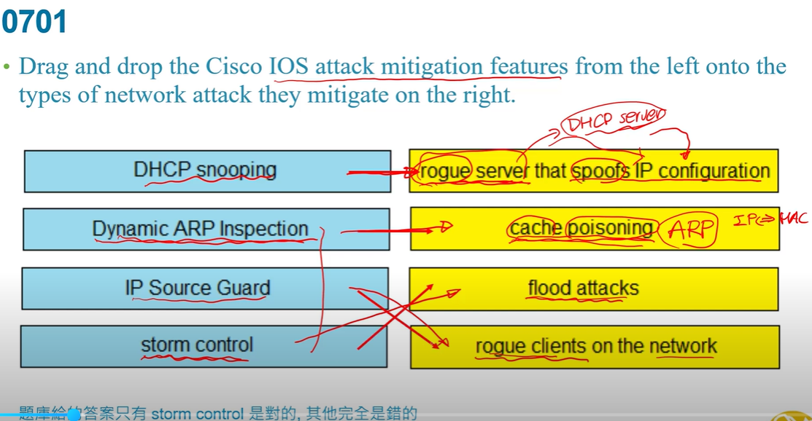
右1:rogue流氓 server ,基本上就是一個惡意的DHCP server   
左2:主要就是電腦上會有ARP快取,紀錄哪個ip對應哪個網卡卡號  
左4:設定port最多接收多少網路流量,就不會爆開  

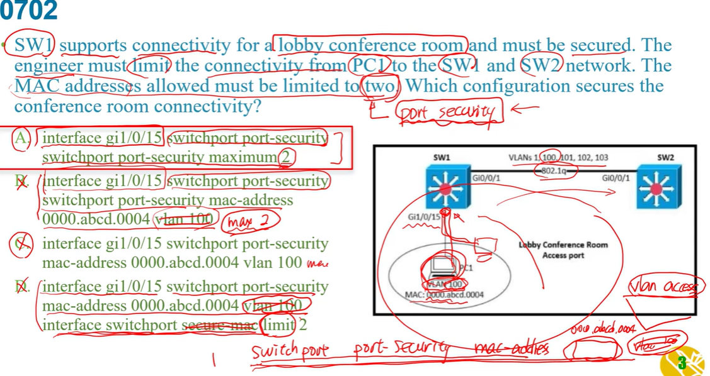
a:代表示動態學習兩個網卡卡號  
b:後面不能再接vlan100,而且少了 maximum 2  
c:沒max2  
d:ip地址後一樣不可接vlan,沒有需要設secure-mac   

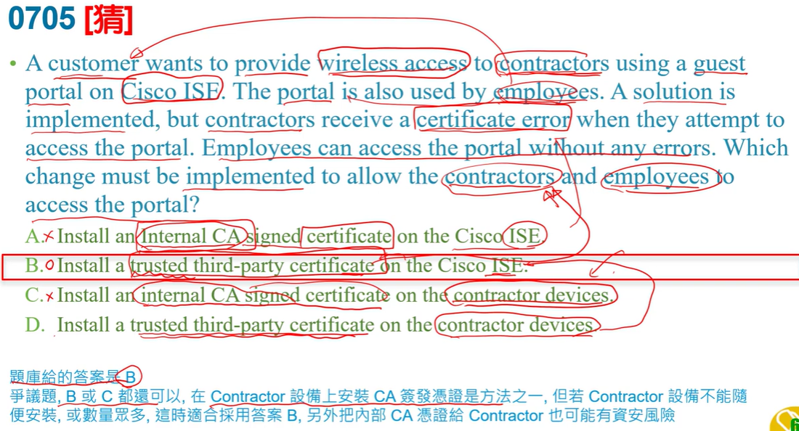
ISE是帳號認證用的  
只有承包商會有certificate error  
a:ISE本身就有憑證管理,主要是承包商certificate不被ISE接受(因為不是該公司的)  
C:怎麼可能在承包商設備上放內部的東西  

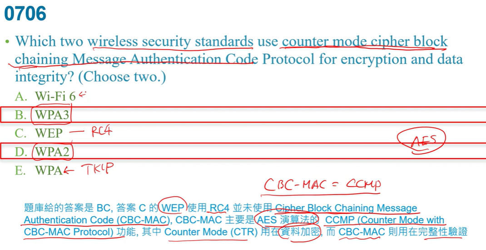
A:無關,不是SECURITY標準  
c:wep這麼舊的東西不可能  

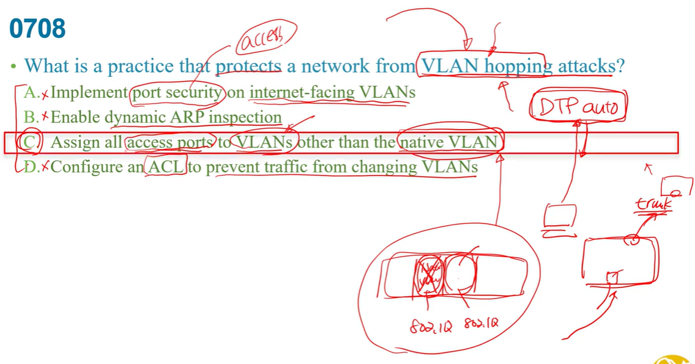
a:用port security可知是access就不會有vlan hopping    
b:防ARP spoofing   
c:相對合適的答案  
d:ACL不會管到  

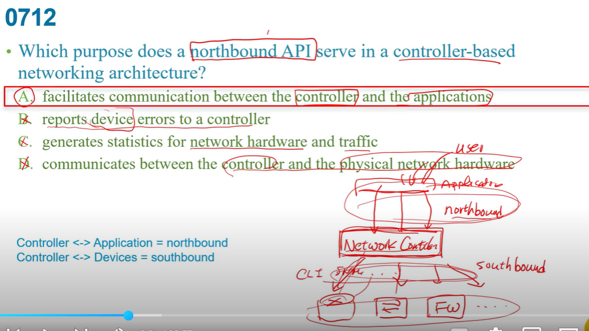
controller 集中管控底下設備  
northbound就是controller與application 之間的   
b:是southbound的工作  
d:是southbound的工作  

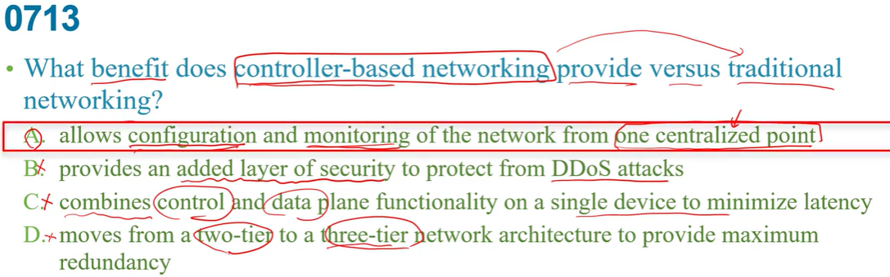
a:one centralized point 其實就是controller  
b:不是為了資安   
c:是要分離   
d:網路架構和controller-base比較無關   

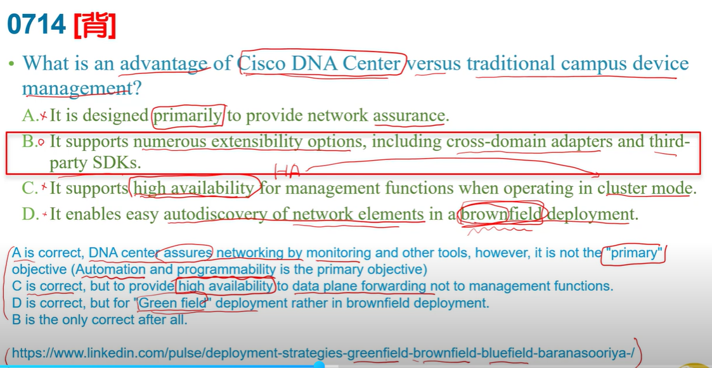
a:主要是為了Automation和Programmability自動化和可編程性   
c:是在data plane 不是管理階層  
d:正常來說新的網路設備應該是greenfield  

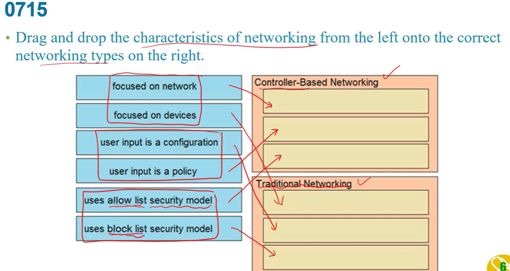
傳統網路:
+ 傳統網路主要以設備為主不是整個網路  
+ 一台機器一台基寄給檔案設定  

controller base:  
+ 整個網路 
+ 透過northbound管理底下設備,所以是一個policy  
+ 要求安全性所以已白名單  

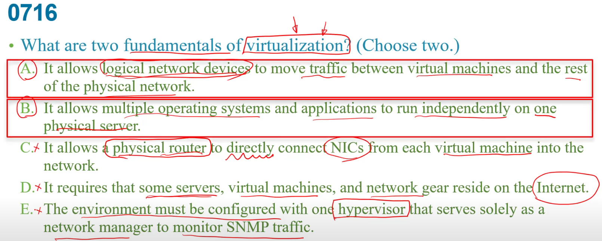
c:中間會透過hypervisor,不可能直接連網卡   
d:是可以把這些放網路,但是虛擬化是把實體元件像cpu,ram...抽象化變虛擬元件      
e:hypervisor是虛擬與實體之間的介面   

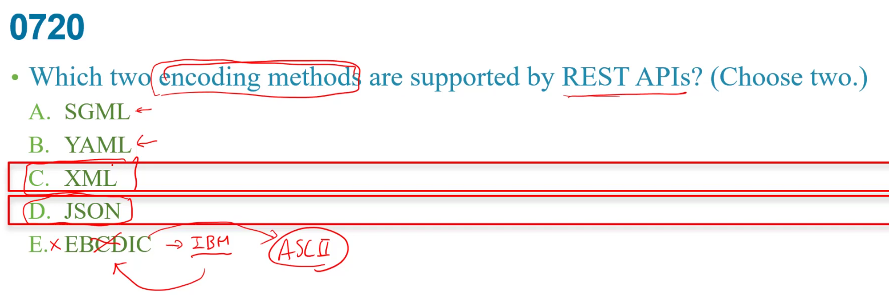
a:html進階  
e:非常早期ASCII都還沒出來  

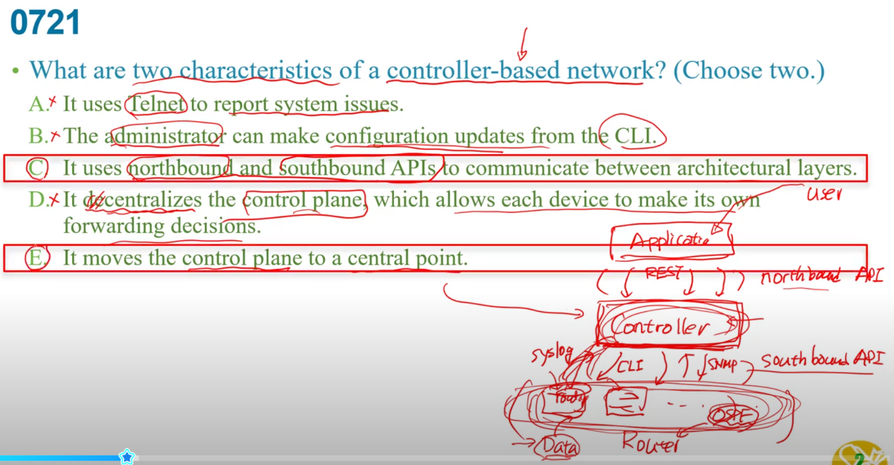
b:直接用CLI就用不到controller了  
d:是要centralized集中,把control plane 的東西集中到controller上  
e:就是controller  

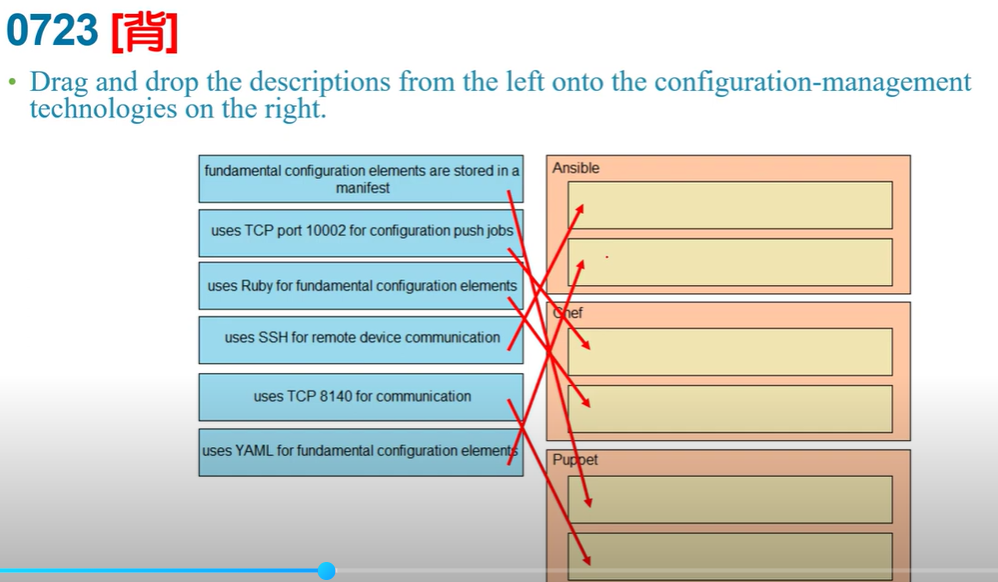
### ansible  
+ YAML  
+ SSH  
+ Playbook  
### Chef  
+ Ruby  
+ TCP 10002  
+ cookbook,recipe      

### Pupoet 
+ manifest  
+ TCP 8140

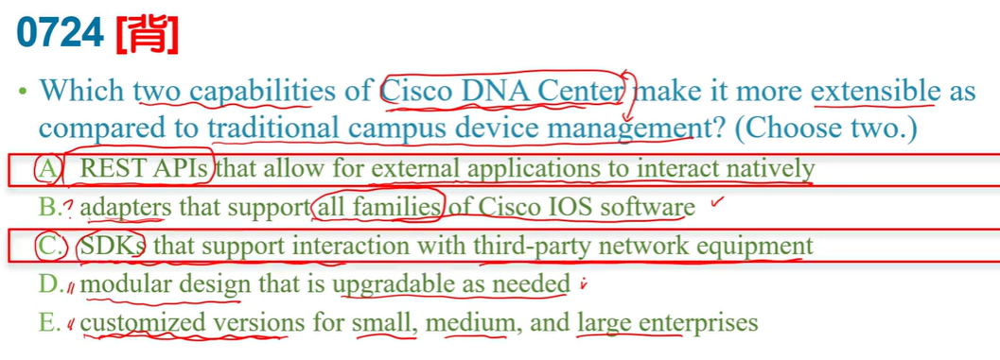
DNA Center要想到controller-based  
a:controller-base有支援,用rest api去管理  
b:比較不可能支援所有  
d:沒有這樣特性,他是一個系統的環境  
e:不太有因為企業大小而分別有客製化  

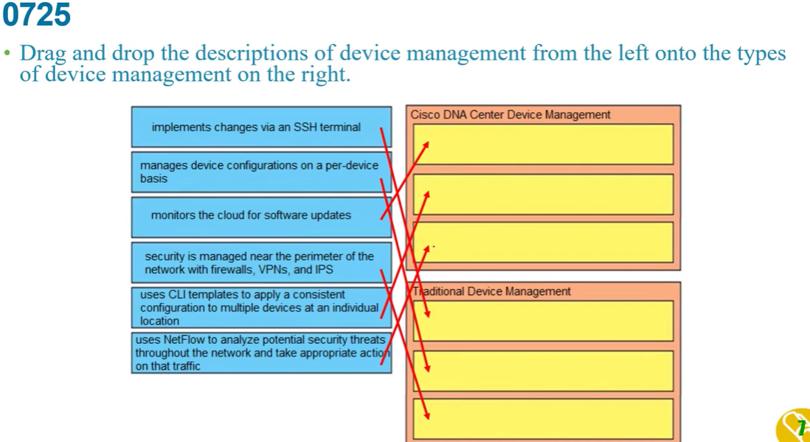
1.ssh終端機是每台機器透過secure share的方式連到那台機器,在終端機上修改  
4.perimeter周邊,  
如果是DNA Center會在center上的圖形化介面管理,而不是其他網路設備  

5.用一個template下一致性指令去管理多個裝置  
6.Netflow是southbound回報和control之間的方式  

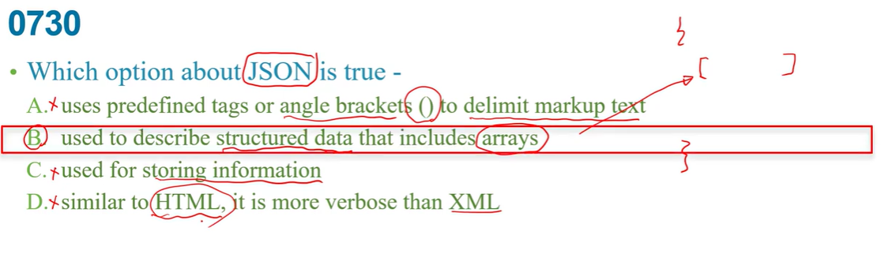
a:jason是大括號,array是中括號  
b:描述結構化資料  
c:這主要是交換的coding方式,交換資料的encoding方式不是儲存資料  
d:和html差蠻多的    

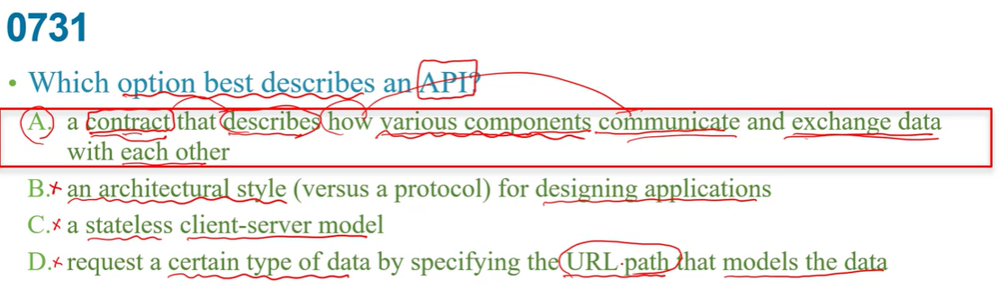
a:一個規則說明不同元件間如何溝通  
b:API不是設計的一個風格   

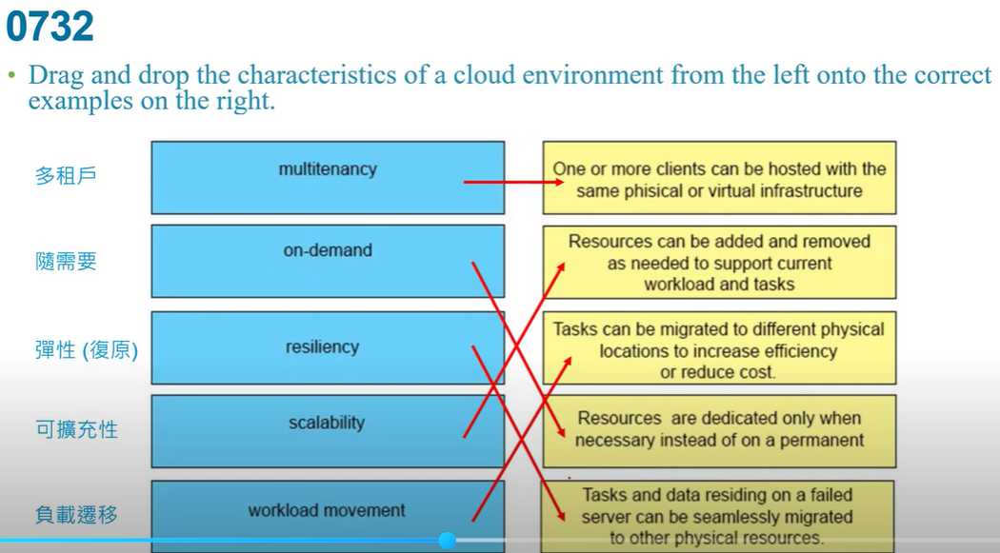
右2:根據需求增加或減少  
右4:only when necessary 需求  
右5:seamlessly無縫地  

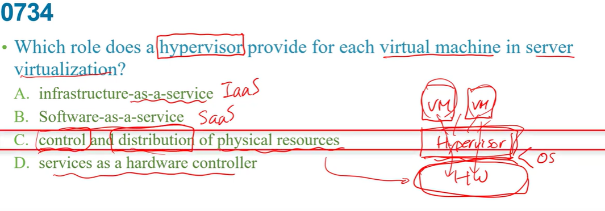
當VM和實體資源之間的介面  

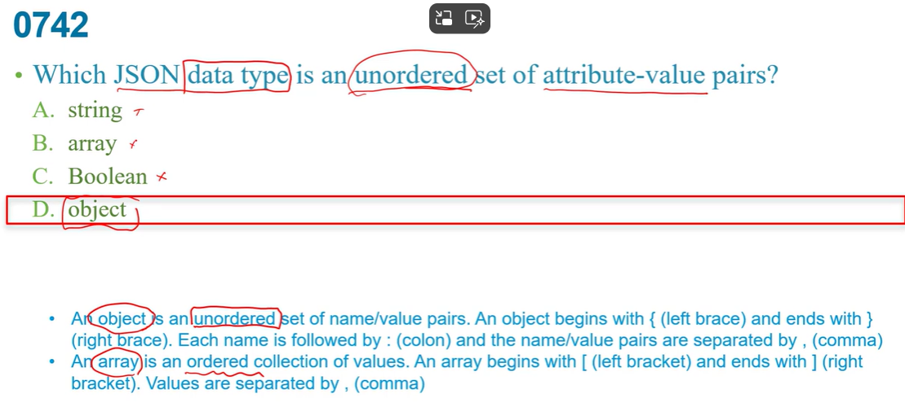
"unordered" 所以是object   
array是有order的  

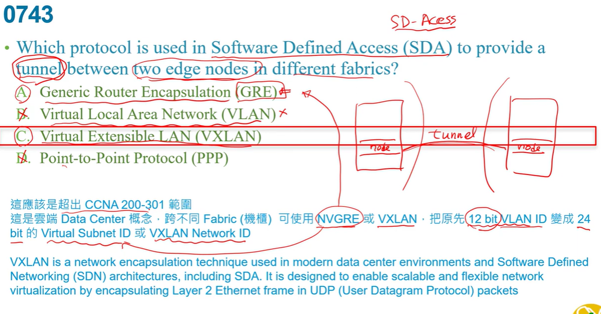
a:主要是layer3的tunnel用,但他沒有加密,跨vlan主要用NVGRE      
b:vlan不是一個tunnel的protocol  
d:是用於專線用也不是tunnel  
