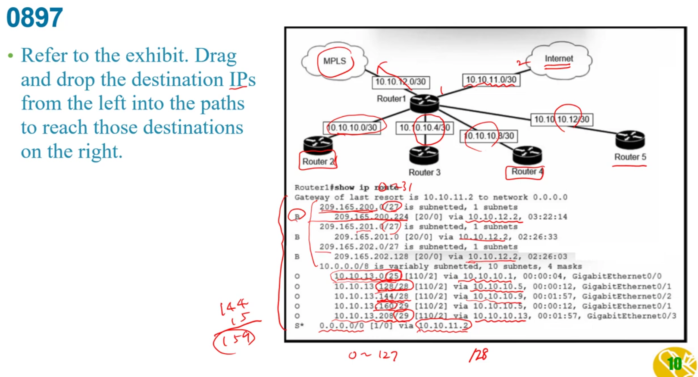
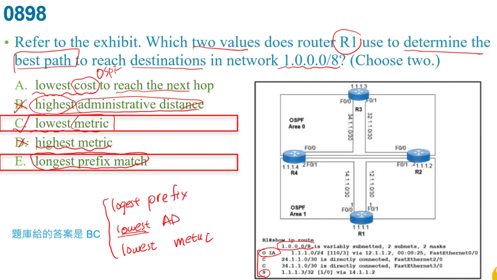

右邊最後兩個Software都是指os  
+ host管physical hardware  
+ guest管vital machines  

a:專線其實不便宜  

不重疊頻道1,6,11  
a:使用不重疊是為了減少干擾,要增加是看採用哪個802.11技術    
b:無限射頻的環境和overlapping基本上是一樣,只是會有干擾問題  

SSID識別無線網路的服務  
a:後面錯,不是識別哪個應用程式該連接  
bc:不是識別有線網路  

3個non-overlapping channel的是2.4GHz  
23個non-overlapping channel的是5GHz  

不要看到linklocal就以為是FE80,他有說是multicast  
就有FF02::1 --->all node   
和FF02::2 ----->all router    

b:oversubscription用戶數量太多了,但也可以移到別的leaf,不一定要增加  
c:server都是接在leaf,不會接在spine  
d:不會做  

b:不管哪個vlan都會做學習  

d:16*6=96個bit 未達128bit  

多模光纖僅有62.5,50  
除了OM1有用62.5以外  
2,3,4都是50  

會發生CRC問題通常是雙工的問題,或是cable附近有電磁干擾   

a:不會是圖像GUI,而是CLI命令行介面  
b:是SSH  
c:console是out of band   
d:未加密的file可能是FTP,TFTP    

a:status要先勾起來,SSID服務才會先起來,才有可能連線  
b:radius policy--->a是5G , b是2.4G , g是2.4G高速  
d:和題目無關  
e:沒勾代表ssid是隱藏的,不一定要做 

a:不管RSTP或PVST都是只有一個路徑  
B:是網路架構的設定和這無關  
C:不同vlan是不同subnet,因此是無法變成一個spanning-tree    

  
RF channel=Radio Frequency channel
A:controller強項  
b:autonomous從一個AP到另一個AP之間就直接斷線重連了,沒有什麼認證漫遊...一定要經過controller  
c:只要是PA本來就會發出beacon  
d:WAP太舊了  
e:CSMA/CA   

Web Passthrough透過後端網路做認證,所以WLC需要關掉認證,因為是由後端認證而不是AP了 

b:應該要是r2的192.168.12.2  
c:現在是area1  
d:同上  

a:是一個host route   
b:因為遮罩/32,只有一個ip    

選metric大的就是後面的  

不難,但花時間
透過10.10.10.1可知在R2的10.10.10.0內  

最常的prefix > 最低AD值 > 最小的metric  

需要public ip   
a:fe80是link-local   
b:邀接當internet不會是anycast  
d:設定link-local 但不是public  

