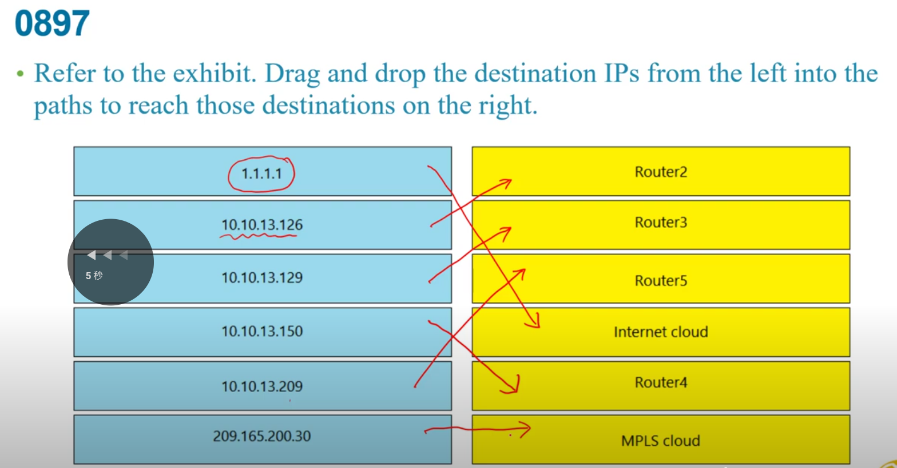
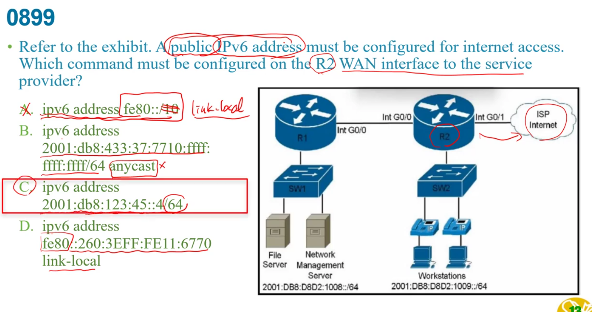

右邊最後兩個Software都是指os  
+ host管physical hardware  
+ guest管vital machines  

a:專線其實不便宜  

不重疊頻道1,6,11  
a:使用不重疊是為了減少干擾,要增加是看採用哪個802.11技術    
b:無限射頻的環境和overlapping基本上是一樣,只是會有干擾問題  

SSID識別無線網路的服務  
a:後面錯,不是識別哪個應用程式該連接  
bc:不是識別有線網路  

3個non-overlapping channel的是2.4GHz  
23個non-overlapping channel的是5GHz  

不要看到linklocal就以為是FE80,他有說是multicast  
就有FF02::1 --->all node   
和FF02::2 ----->all router    

b:oversubscription用戶數量太多了,但也可以移到別的leaf,不一定要增加  
c:server都是接在leaf,不會接在spine  
d:不會做  

b:不管哪個vlan都會做學習  

d:16*6=96個bit 未達128bit  

多模光纖僅有62.5,50  
除了OM1有用62.5以外  
2,3,4都是50  

會發生CRC問題通常是雙工的問題,或是cable附近有電磁干擾   

a:不會是圖像GUI,而是CLI命令行介面  
b:是SSH  
c:console是out of band   
d:未加密的file可能是FTP,TFTP    

a:status要先勾起來,SSID服務才會先起來,才有可能連線  
b:radius policy--->a是5G , b是2.4G , g是2.4G高速  
d:和題目無關  
e:沒勾代表ssid是隱藏的,不一定要做 

a:不管RSTP或PVST都是只有一個路徑  
B:是網路架構的設定和這無關  
C:不同vlan是不同subnet,因此是無法變成一個spanning-tree    

  
RF channel=Radio Frequency channel
A:controller強項  
b:autonomous從一個AP到另一個AP之間就直接斷線重連了,沒有什麼認證漫遊...一定要經過controller  
c:只要是PA本來就會發出beacon  
d:WAP太舊了  
e:CSMA/CA   

Web Passthrough透過後端網路做認證,所以WLC需要關掉認證,因為是由後端認證而不是AP了 

題目不確定access level是哪個  
a:看802.11frequency適用哪個  

要維持使用相同ip要用啟用static IP Tunneling  
c:較無關  

要在G1/0/1用LLDP其他則off  
所以要LLDP run  
a:CDP才用enable,LLDP適用transmit,received  
b:底下兩行代表lldp run意思  
c:run的啟用沒有在介面上  
d:enable是在介面上的  

SIP主要是用在網路電話  
a:要設到白金level  
b:算對  

a:和telnet無關  

rapid PVST+是有  
+ blocking  
+ learning  
+ forwarding  
+ disable  

右下三個要注意  
community vlan是private的名詞   

Flexconnect mode:和controller之間中斷,還是可在不同vlan之間做一些流量傳送  

convergence收斂    
mitigae減輕  
a:要看convergence的範圍   
b:不會因為用portfast緩解  

a:是累加cost最小  
b:root沒有root port ,都是detinated port  

authentication server 一般來說就是Radius  
a:WLAN就是要一個新的SSID  
b:沒必要做到需要HA備援的部分  
c:是管理用的,不會說建立起來就要需要透過telnet..去管理interface  
d:前面都有authentication,dynamic interface就已經建置了,就不用再加管理IP    

FlexConnect:只要提到AP不需要controller,或是controller故障AP仍可以正常運作,通常會與FlexConnect有關  

a:一般AP不會有那麼多介面  
b:對的  
d:需要用trunk所以不可能把802.1Qdisabled掉  

timeout0代表不會被自動logout掉  
serial timeout是用在console port  

分公司和總公司之間通常有WAN連線   
連線斷了還要能繼續服務,在本地terminated,就是Flexconnect  

auto:還是有一定電量所以供電差14多了,如果又接AP,就沒有足夠電力給他  
static:一開始就設定port預留電力,還是要偵測對方是不是需要電力的   
a:是偵測出來後,才會提供電力   
d:不管auto,static都要偵測  

要取消限制時間就需要取消勾選guest user  
a:和時間限制沒什麼關西  
c:無法設成0, 

左三:只要廣播就會回傳beacon,所以基本上兩邊都會  

c:case大小寫敏感,  

dynamic interface是對應SSID無線網路的  
virtual interface用途下方有說  

enable section timeout設3600(秒)  
Maximum client設10,最多容納多少   
a:只是允許互連  
c:不是這個,排除客戶  

b:Gi0/2需要是trunk  

關掉10.0.0.0/30的最後一個可用ip  
這個網段是10.0.0.252/30  
所以254是最後一個ip,把他關掉     

service和console都是out of band management  
a:沒這port  

+ 超範圍  
是用CAPWAP DTLS而不是IPssec或EoIP  

d:443是https,21是ftp control用的   

service只做管理是走IP封包  
console是另一個 

bd在吵  

這三點都是controller用的  
要用controller不是雲端內的  

VTP統一vlan資料  
mode有  
+ server:新增刪除修改  
+ client:不能增加刪除修改,一切跟著server    
+ transparent:可刪除新增修改,但只能在自己這機器上  
---->收到VTP資料不會理會,就繼續傳下去幫忙轉送  

a:會送但不處理  
b:不處理  
c:是自行管理,不會把local的還送出去  

saturation飽和  
有primary又有secondary就讓他去走secondary  

