1    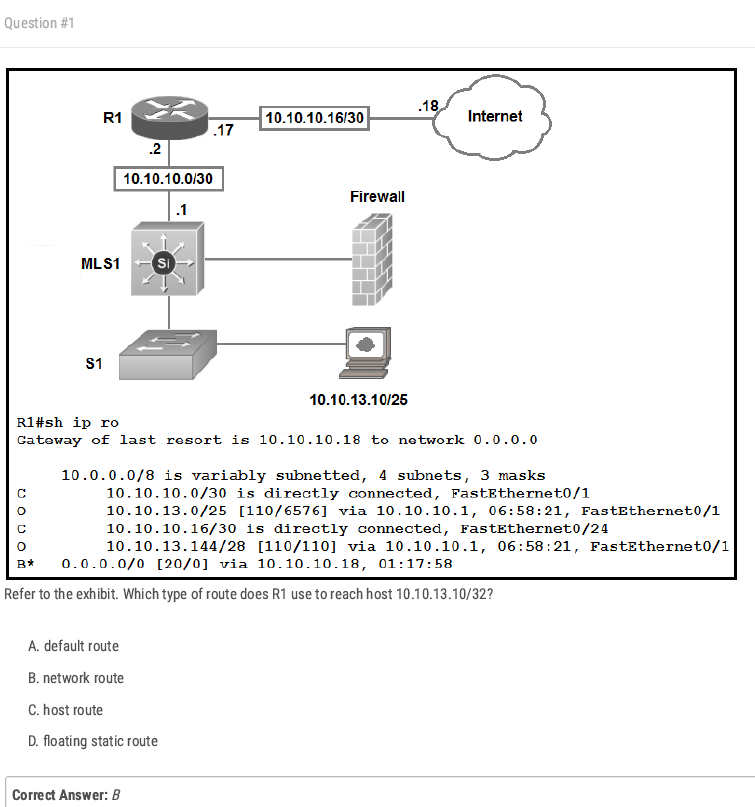  

21  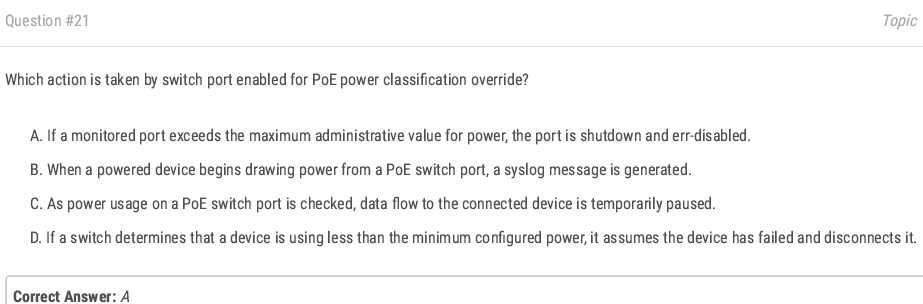
25  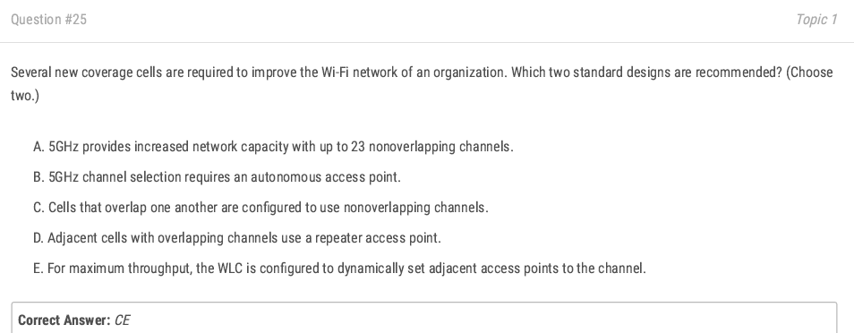
28 a:ap和controller之間基本都走網路的  
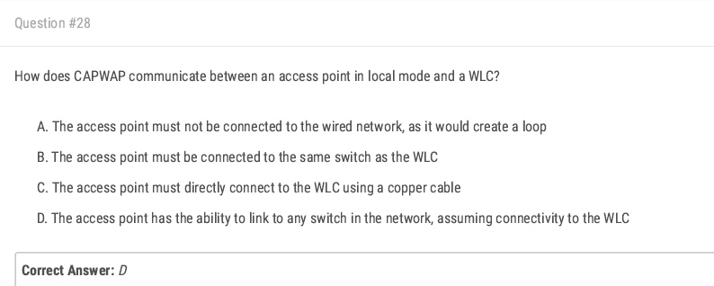
31  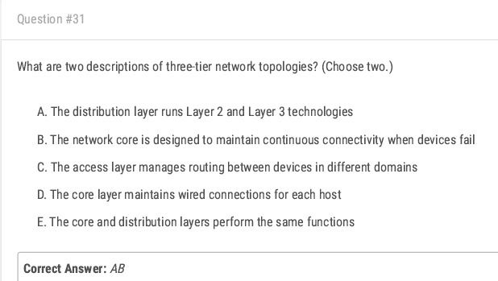

42  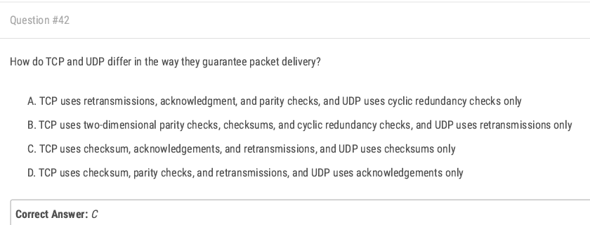

59  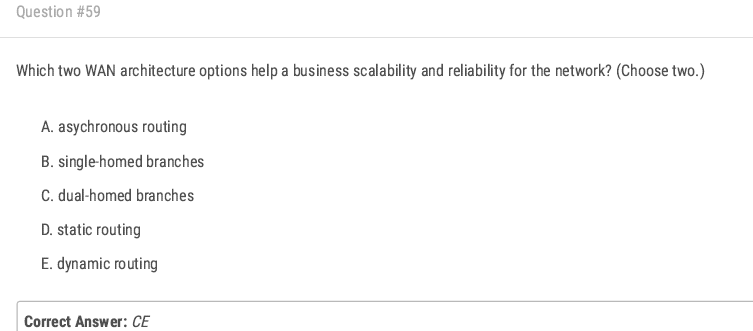
60*  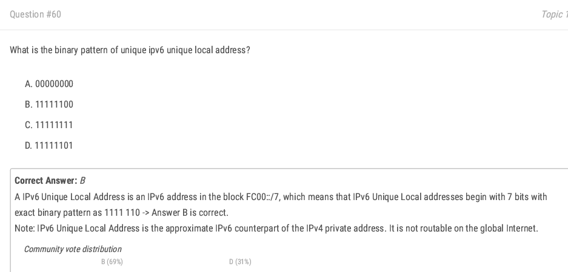老師認為D  

  
 
86 考專線寬頻,先不背 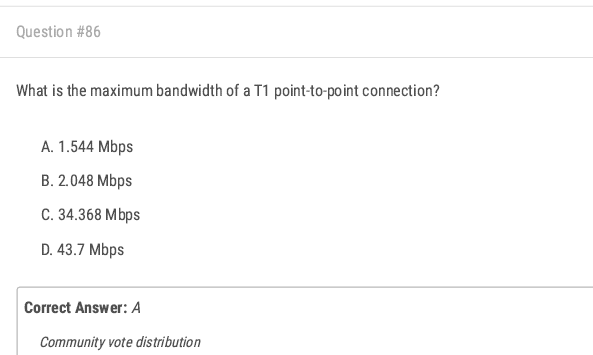   
87 我有對喔~ 背線材速度,考前看看就好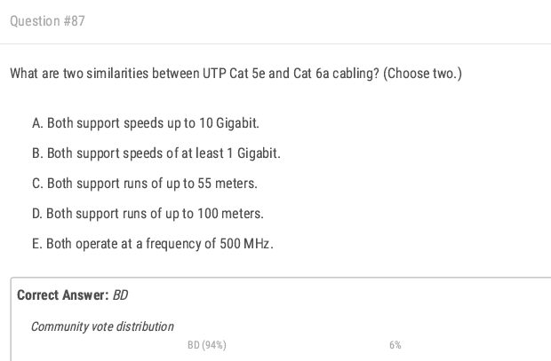  

102 我也對~喔背線材  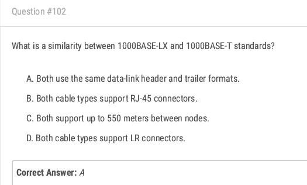  
103  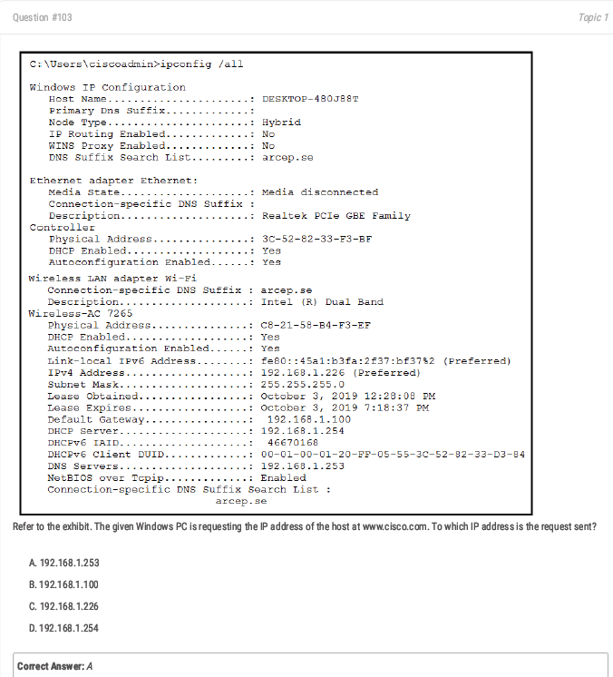  
  
  
      
132 會了 但計算題很好玩  
  
  
  
154  resolve是回應客戶的,domain是url  
  
161  線材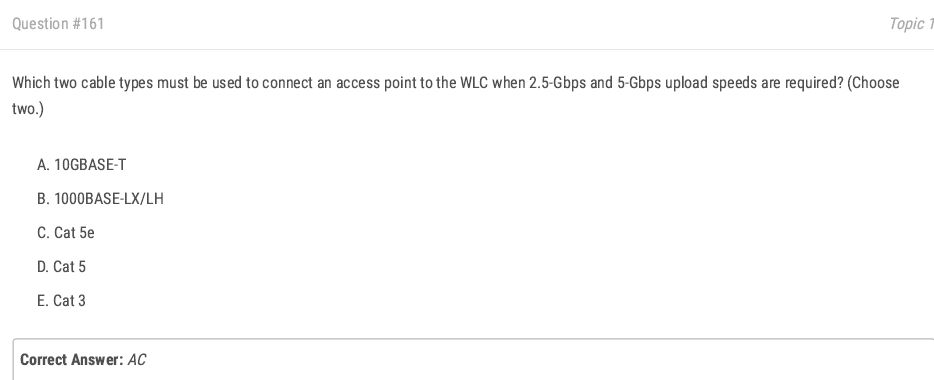 cat5e和cat6,都有2.5和5Gbps    
168 一樣線材  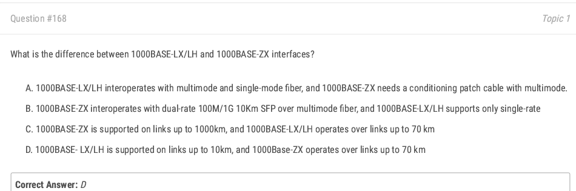 長到靠杯  

  
 
175**  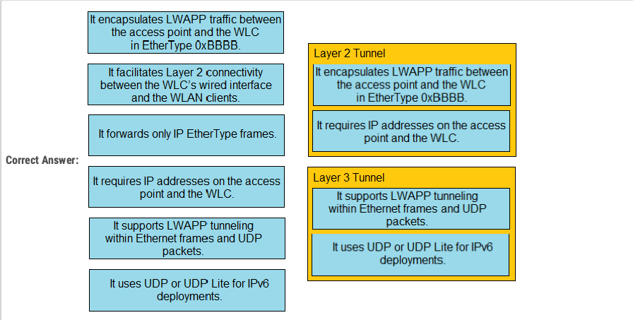
  
180 背最高級金屬白金  
  

197  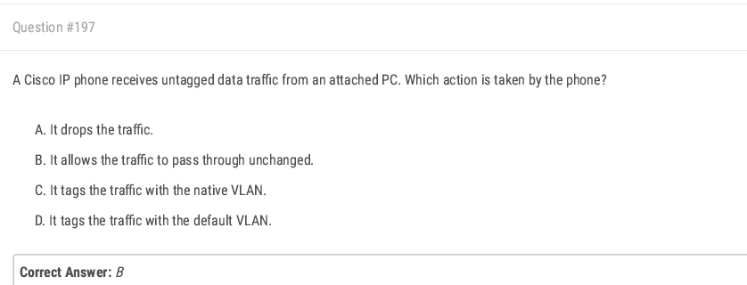
  
207 考前看一看 cisco wireless lan controller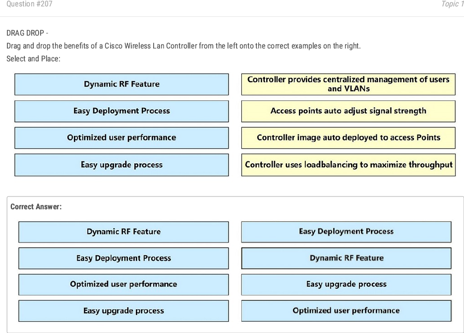  
  
211*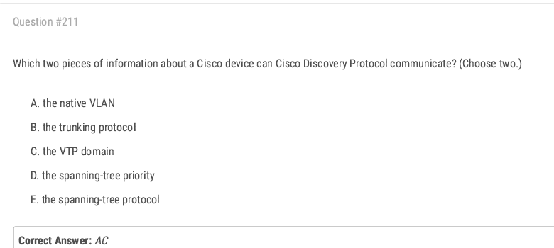 這兩個以及duplex setting 
  
  
216   
220  
223  
225  
226 考前背  
228  
229  
241  
252  
261 考前看   
264  
267  
269 背  
275 背吧 怪  
285  
288  
297  
301  
312 背  
322 陷阱  
335 考前看一下  
336 可跳過  
340  
341   
344   
348  
350  
353  
363  
366 考前看看  
367 考前看  
373 背指令  
376 考前背  
377   
381  
382 e怪,考前看  
384  
385 考前看  
388 考前看
391* 學計算   
394   
397 指令  
402*  
406 考前看   
408 routing table考前看    
413*  
418*   
421 考前背 virtual mac  
424 考前背  
426  
427  
442  
454  
460  
476*  
494 考前背  
500  
502  
510  
514  
515  
516 我對,但背 dhcp  
517  考前背 dhcp  
519  
520 考前看dhcp  
521  
525 背  
530* 考前看dhcp relay設置位置  
540 
545  網管細部功能  
547  
552 考前看  
553 記有Q的     
557  
566  
568  
569  
576*  
580  
583 連連看 背  
586 考前看  
588  
589  
601  
604 sticking  
611   
618 考前看  
623  
624*  
634*  
636  
638  
648  
650  
655  
667  
675*  考前看,沒印象   
677 題目有問題  
691  
696  
702  
714  
715 controller-based是用allow list security 不是block  
725*  
734  
743 超範圍  
745  
751*  
775  
779*  
790 超範圍  
794*  
800 考前背   
801   
818  
825 考前背  
837  
839*  
841 題目有點問題  
843 a  
845 超範圍 背  
851  
861  
864 考前背  
865 英文太菜 注意一下  
866  
867  
869  英文太菜 注意一下    
874   
894  
905  
909 題目不清 背  
914 考前看  
915*  
917 陷阱  
924*  
932*  
950  
951 送他了有時間在背  
952  
958  
960 考前看 dns流程  

  

