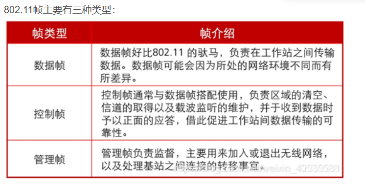

1  
4  
  https://blog.csdn.net/weixin_40535588/article/details/112765278  

12  
21  
24  
25  
28 a:ap和controller之間基本都走網路的  
31  
33  
35 ip二進位不能0 1 交錯  
39  
42  
43  
+ Band Select:開啟Band select之後,AP會進入讓使用者盡量連到5G的判斷機制  
+ DTIM: Delivery Traffic indication Message,為AP在Multicast 環境省電機制之一   
+ RX-SOP: Receiver Start of Packet,用以調整能接受訊號號強度的門檻值  
+ AAA override: 允許AP根據RADIUS的回應進行參數調整  

48  
53  
58   
59  
60*  
62  
63  
65  
86 考專線寬頻,先不背  
87 背線材速度,考前看看就好   
93  
102 背線材  
103  
114  
116  
121  
128  背電力供給模式          
132 會了 但計算題很好玩  
134  
140  
144  
154  
158  
161  
168 一樣線材  
171  
172  
175  
179*  
180 背最高級金屬白金  
181  
187  
190 
197  
198  
207 考前看一看 cisco wireless lan controller  
209 陷阱  
211  
212  
215  
216   
220  
223  
225  
226 考前背  
228  
229  
241  
252  
261 考前看   
264  
267  
269 背  
275 背吧 怪  
285  
288  
297  
301  
312 背  
322 陷阱  
335 考前看一下  
336 可跳過  
340  
341   
344   
348  
350  
353  
363  
366 考前看看  
367 考前看  
373 背指令  
376 考前背  
377   
381  
382 e怪,考前看  
384  
385 考前看  
388 考前看
391* 學計算   
394   
397 指令  
402*  
406 考前看   
408 routing table考前看    
413*  
418*   
421 考前背 virtual mac  
424 考前背  
426  
427  
442  
454  
460  
476*  
494 考前背  
500  
502  
510  
514  
515  
516 我對,但背 dhcp  
517  考前背 dhcp  
519  
520 考前看dhcp  
521  
525 背  
530* 考前看dhcp relay設置位置  
540 
545  網管細部功能  
547  
552 考前看  
553 記有Q的     
557  
566  
568  
569  
576*  
580  
583 連連看 背  
586 考前看  
588  
589  
601  
604 sticking  
611   
618 考前看  
623  
624*  
634*  
636  
638  
648  
650  
655  
667  
675*  考前看,沒印象   
677 題目有問題  
691  
696  
702  
714  
715 controller-based是用allow list security 不是block  
725*  
734  
743 超範圍  
745  
751*  
775  
779*  
790 超範圍  
794*  
800 考前背  
  

